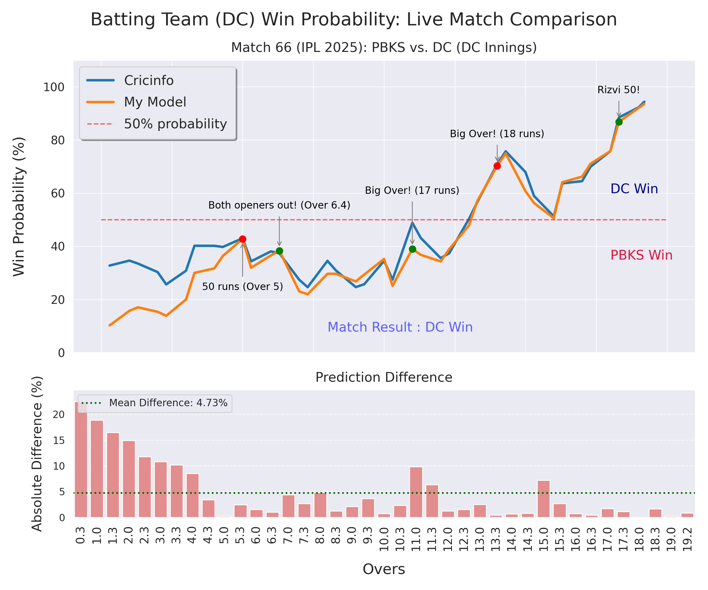

# 🏏 T20 Cricket Match Win Probability Predictor

**[🚀 Try the Live Demo Here!](https://ipl-win-proba-calc-v1.streamlit.app/)**

This project develops a machine learning model to predict **real-time win probabilities** for cricket matches during second innings chases. Beyond just predicting the final outcome, this model aims to provide dynamic insights into how match conditions – such as runs scored, wickets fallen, and overs played and others – influence the likelihood of victory.

---

## 🎯 Project Goal

The primary objective is to build a robust and intuitive win probability predictor that can be validated against established real-world benchmarks, demonstrating an end-to-end data science workflow from model development to interactive deployment.

---

## ✨ Features & Technologies

* **Real-time Probability Prediction:** Dynamic updates to win probabilities as the match progresses.
* **Comprehensive Feature Engineering:** Utilizes key in-match statistics like runs scored, wickets taken, and overs completed.
* **Robust Preprocessing Pipeline:** Employs `scikit-learn`'s `ColumnTransformer` and `OneHotEncoder` for handling categorical features, ensuring consistency between training and deployment.
* **Model Validation:** Comparative analysis against professional benchmarks (e.g., ESPN Cricinfo).
* **Interactive Web Application:** Built with `Streamlit` for an accessible user interface.
* **Deployment Ready:** Model saved using `joblib` for seamless integration into web services.

**Technologies Used:**

* **Python**
* **Pandas** (Data Manipulation)
* **NumPy** (Numerical Operations)
* **Scikit-learn** (Machine Learning Model & Preprocessing)
* **Joblib** (Model Serialization)
* **Streamlit** (Web Application Framework)
* **Matplotlib & Seaborn** (Data Visualization)

---

## 📊 Model Performance: Live Match Validation

A true test of any predictive model lies in its real-world performance, especially for dynamic events like a cricket match. For win probability, **probability calibration** – how closely the predicted probabilities align with actual observed frequencies – is often more crucial than simple classification accuracy.

To validate my model's capabilities, I tracked few live cricket matches (Punjab Kings vs. Delhi Capitals, for example) and compared their real-time win probability predictions against those displayed on the highly reputable **ESPN Cricinfo** website.

### **Visualizing Live Probability Shifts**

The plot below illustrates how both my model's and Cricinfo's predicted win probabilities for the **Batting Team** evolved over the course of the match, culminating in their win. Key events that influenced the momentum are also highlighted, providing essential context to the probability swings.

### **Quantitative Comparison**

Beyond visual alignment, it's essential to quantify the agreement between the two prediction sources. I calculated the **Absolute Difference** in win probabilities at each over, providing a clear view of how closely my model tracked Cricinfo's predictions.



As observed, the average absolute difference between my model's probabilities and Cricinfo's was **~5%**, demonstrating a strong concordance. This metric, along with visual congruence, highlights my model's ability to provide well-calibrated, dynamic win probability forecasts, a crucial feature for real-time sports analytics.

---
## 🚀 Getting Started

To run this project locally:

1.  **Clone the repository:**
    ```bash
    git clone [https://github.com/anbose/ipl_win_probability_calculator.git](https://github.com/anbose/ipl_win_probability_calculator.git)
    cd ipl_win_probability_calculator
    ```
2.  **Create a virtual environment (recommended):**
    ```bash
    python -m venv venv
    source venv/bin/activate  # On Windows: `venv\Scripts\activate`
    ```
3.  **Install dependencies:**
    ```bash
    pip install -r requirements.txt
    ```
4.  **Run the Streamlit application:**
    ```bash
    streamlit run IPL_predictor.py
    ```
---

## 🔮 Future Enhancements

* **Advanced Models:** Explore more complex models like XGBoost or LightGBM for potentially higher predictive power.
* **More Granular Features:** Incorporate player form, pitch conditions, and historical head-to-head statistics.
* **Live Data Integration:** Develop a more robust system for real-time data ingestion during live matches.
* **Probabilistic Calibration:** Implement explicit calibration techniques (e.g., Platt Scaling, Isotonic Regression) if more complex models are used and exhibit poor calibration.

---

## Acknowledgements

* Data sourced from [https://www.kaggle.com/datasets/manasgarg/ipl/data].

## Contact

Feel free to reach out with any questions or feedback!

* https://www.linkedin.com/in/anbose/
